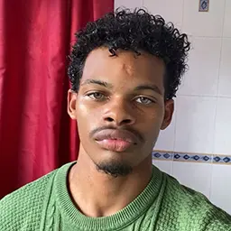

[ma bannière](../statique/media/interface/banniere.svg)
# FlashBack
---
| Romane Medina | Chris Régis Noel |
|:--------:|:--------:| 
| |   |
|  romane.medina7@etu.univ-lorraine.fr |chris.regis3@etu.univ-lorraine.fr|

>lien vers le site web : 
 https://webetu.iutnc.univ-lorraine.fr/~e9676u/sae105-flashback/statique/ 

## Table of Contents 
- [Justification Nom](#p1)
- [Objectif du site](#p2)
- [Motivation](#p3)
- [Description](#p4)
- [Json](#p5)
- [Arborescence du site](#p6)
- [Favicon](#p7)
- [Polices](#p8)
- [Validation W3C](#p9)
- [Liste : attendus/contraintes](#p10)
- [Autoévaluation étudiant](#p11)
- [Autoévaluation groupe](#p12)
- [Crédits](#p13)
- [Elements supplémentaires](#p14)

## Justification Nom 
- Nous souhaitions un nom facile à retenir, évocateur qui ne laisse pas de place au doute et évidemment en rapport avec notre site et ce qu'on propose comme service, c'est là que nous ai venu l'idée de l'appeler "FlashBack", ce nom exprime tout de suite ce que nous souhaitons offrir, de la nostalgie et des souvenirs ravivés !
## Objectif du site 
- Notre site a pour but de permettre à quiconque de renouer avec ses souvenirs, revivre des moments de bonheurs intenses ou d'enfin pouvoir vivre les concerts des plus grands artistes ayant bercé les jeunesse de ceux qui ne sont plus tout jeune. Notre but est de permettre au plus agé et au plus jeune de pouvoir partager une expérience commune forte et émouvante autour d'un centre d'intérèt que nous (Romane et Chris) partageons, la musique.
## Motivation 
>Chris

"Sincèrement au départ je n'étais pas plus emballé par cette idée de création de site Web, surtout que je n'avait aucune idée de quel produit/servivce on allait vendre, mais c'est là que Romane eu l'idée de se concentrer sur le monde de la musique, un art particulièrement apprécier par la majorité des gens, puis de là je me suis laisser emporter par la satisfaction de voir mes lignes de codes prendre vie."
>Romane

";vcxcvjklkhgfdghjklkhgf"
## Description 

## JSon 
## Arborescence du site 
[arborescence](../statique/media/arbo.webp)
## Favicon 

 32x32

## Polices 
**Détail sur la bannière** : Pixelify Sans (Google fonts designed by Stefie Justprince)

**Titre**  : Audiowide (Google fonts designed by Astigmatic)

**Paragraphe** : Montserrat (Google fonts designed by Julieta Ulanovsky, Sol Matas, Juan Pablo del Peral, Jacques le Bailly)
## Validation W3C 
## Liste : attendus/contraintes 
## Autoévaluation étudiant 
## Autoévaluation groupe 
## Crédits
## Elements supplémentaires
